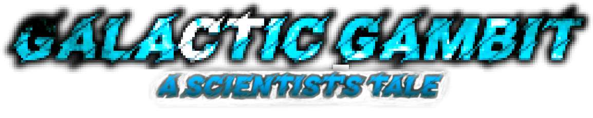

<div align="center">
	<h1><strong>GALACTIC GAMBIT</strong></h1>
</div>
<div align="center">

A **2D roguelike videogame** made with [Pygame](https://www.pygame.org/) for an university project. 🎮🐍



</div>

#

<details open>
<summary><strong>DESCRIPTION</strong></summary>
<br>

The game is a **top-down shooter** where the protagonist is an astronaut who has to fight against aliens in order to find a strange singal emitter in a remote planet. 🪐

Our hero will try to survive while he gets more powerful through a **system of tech and magic upgrades**. 🚀

The game is divided into three levels, each one with a different locations and different enemies:

**→ Spaceship**


**→ Planet**


**→ Cave**


</details>

<details open>
<summary><strong>RUNNING THE GAME</strong></summary>
<br>

To run the game, execute from the root directory:

```
pip install -r requirements.txt
python3 run_game.py
```

</details>

**Dependencies**

- [pygame](https://www.pygame.org)
- [numpy](https://numpy.org)
- [noise](https://pypi.org/project/noise/)

<details open>
<summary><strong>CREDITS</strong></summary>
<br>

Many thanks to all the artist who made the assets (including the sprites, the music and the fonts) available to all of us for free.
Mention to:

- [Freepik](https://www.freepik.com)
- [Flaticon](https://www.flaticon.com)
</details>
